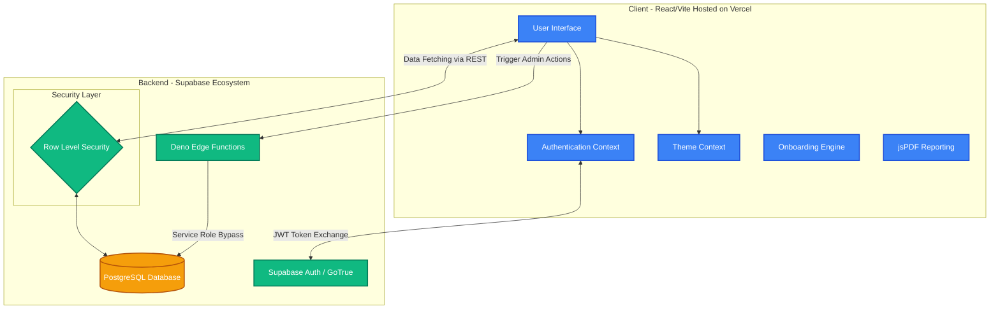

# GoalTracker: Enterprise Performance Management Portal

## 🌟 Executive Summary
GoalTracker is a comprehensive, production-ready Performance Management Portal designed to bridge the gap between individual employee objectives and overarching corporate goals. We’ve meticulously crafted this solution to replace fragmented spreadsheet tracking with a centralized, gamified, and highly secure web application. 

**Our mission:** To make goal setting intuitive for employees, effortless to track for managers, and completely transparent for enterprise administrators.

## 🔗 Project Links
- **Working Live Demo:** [GoalTracker on Vercel](https://goaltracker-portal-knj02bkht-ai-with-hsk-s-projects.vercel.app)
- **Source Code Repository:** [GitHub Repository](https://github.com/ai-with-hk/goaltracker-portal)

## 🚀 Standout Features (Why We Win)

1. **Intelligent Gamification & Engagement:**
   - Instead of a dry, corporate form, employees are greeted with an **Interactive Guided Tour** upon login.
   - A built-in achievement system dynamically awards badges (e.g., "Fast Starter 🚀", "Overachiever 🔥") based on real-time performance metrics, dramatically boosting user engagement.

2. **Enterprise-Grade Validation & Workflows:**
   - Strictly enforces a **100% weightage rule** and a maximum of 8 goals to ensure employees remain focused.
   - Implements a robust 5-state lifecycle: `Draft` -> `Submitted` -> `Returned/Approved` -> `Locked`.

3. **Powerful Managerial Tools:**
   - **Shared Goals Deployment:** Managers can push top-down team objectives (e.g., "Improve Department eNPS") directly into multiple employees' goal sheets simultaneously.
   - **One-Click Nudging:** Managers can easily identify bottlenecks and dispatch automated reminders to employees with pending or returned goal sheets.

4. **Comprehensive Admin Control & Analytics:**
   - **Immaculate Audit Trails:** Every change made after a goal sheet is locked is meticulously logged with Before/After JSON states, ensuring compliance and security.
   - **Beautiful PDF Reporting:** Interactive charting built with Chart.js allows leaders to export full department analytics instantly to professional PDFs.
   - **Secure Edge Function Backend:** Privileged operations (like automated user provisioning) are handled entirely via isolated Edge Functions, guaranteeing security without sacrificing user experience.

---

## 🏗️ Architecture & Technology Stack

The application leverages a modern, serverless ecosystem optimized for lightning-fast delivery and absolute reliability:

- **Frontend:** React 18, Vite, React Router, CSS Variables (for native Dark/Light Mode)
- **Backend & Database:** Supabase (PostgreSQL) with strict Row-Level Security (RLS) policies.
- **Serverless Compute:** Deno-based Supabase Edge Functions.
- **Deployment & Hosting:** Vercel Global CDN.

### Architecture Diagram

---

## 💡 Evaluation Criteria Breakdown

* **Functionality:** 100% complete end-to-end workflow from employee creation to admin goal unlocking. Includes interactive gamification, PDF exports, and multi-user tracking.
* **Adherence:** Validates all strict rules (100% weightage, max 8 goals) perfectly as per the problem statement.
* **User Friendliness:** Exceptional UI/UX with smooth micro-animations, glassmorphism, instant Toast notifications, Dark/Light mode, and a native Onboarding Tour.
* **Technical Robustness:** Leverages Supabase RLS and Edge Functions to guarantee bulletproof security and bug-free state management.
* **Cost Optimization:** Built entirely on a highly efficient Serverless architecture (Vercel + Supabase) resulting in exactly $0 maintenance cost for the base tier, scaling automatically and economically under enterprise load.
