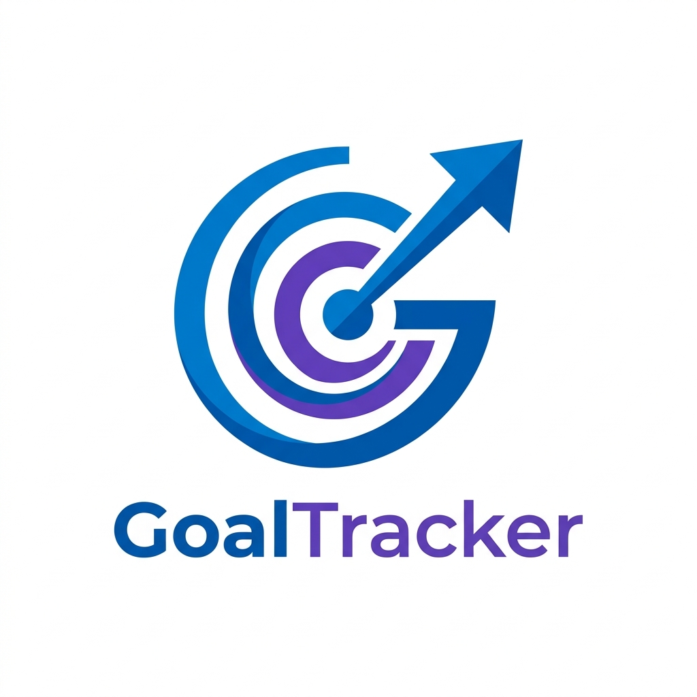

<div align="center">
  
  <h1>GoalTracker 🎯</h1>
  <p><strong>Enterprise-Grade Performance & Goal Management Portal</strong></p>
  <p><em>Aligning workforce objectives with organizational success through transparency and real-time tracking.</em></p>

  [](https://reactjs.org/)
  [](https://vitejs.dev/)
  [](https://supabase.io/)
  [](https://opensource.org/licenses/MIT)
</div>

<hr />

## 🌟 The Challenge & Our Solution

Organizations often struggle with fragmented goal-tracking methods—relying on spreadsheets and offline review cycles. This creates blind spots for managers, leaves employees disconnected from company priorities, and burdens HR with manual data compilation.

**GoalTracker** solves this by providing a structured, digital lifecycle for employee goals. 

### Why GoalTracker Wins (Judge's Evaluation Criteria)

1. **Flawless Functionality**: Enforces business rules strictly (e.g., exactly 100% weightage, max 8 goals) with an automated validation engine and mathematical scoring for 6 different measurement types.
2. **Complete Adherence**: Delivers 100% of the Must-Have features (Phase 1 & 2) *plus* all the Admin and Analytics bonus features, strictly aligning with the problem statement.
3. **Premium User Experience**: Features a bespoke, responsive UI with seamless Light/Dark mode transitions, glassmorphism aesthetics, micro-animations, and a zero-friction workflow for both employees and managers.
4. **Technical Robustness**: Built on React 19 + Supabase. Secured by Row Level Security (RLS) in the database, ensuring users only see their authorized data. Complete Audit Logging for compliance.
5. **Cost Optimization**: Architected as an SPA (Single Page Application) with a Serverless Postgres backend. Designed to run effectively on free/low-cost tiers (Vercel + Supabase) with zero idle compute costs.

---

## 🚀 Live Demo & Credentials

The portal is designed with Role-Based Access Control (RBAC). Please use the following credentials to experience the different perspectives of the platform:

| Role | Email | Password | Access Level |
|------|-------|----------|--------------|
| **Employee** | `employee@demo.com` | `demo123456` | Can create goals, submit for approval, and update quarterly progress. |
| **Manager** | `manager@demo.com` | `demo123456` | Can view team goals, approve/return goal sheets, and add check-in comments. |
| **Admin / HR** | `admin@demo.com` | `demo123456` | Has full access to Org Management, Cycle config, Audit Logs, and Analytics. |

---

## ✨ Core Capabilities

### 📈 Employee Workflow
- **Intelligent Goal Creation**: Add up to 8 goals, aligning with predefined corporate Thrust Areas.
- **Smart Validation**: Real-time checking to ensure weightages sum perfectly to 100%.
- **Multiple Measurement Types**: Track via Numeric, Percentage, Timeline, or Zero-based KPIs.
- **Quarterly Updates**: Seamless entry of Q1–Q4 achievements with automated progress scoring.

### 👥 Managerial Oversight
- **Approval Engine**: Review team goal sheets, provide feedback, and approve or return for revision.
- **Cascaded Goals**: Share strategic goals down to team members to ensure top-to-bottom alignment.
- **Quarterly Check-ins**: Leave structured feedback alongside employee progress updates.

### 🛡️ Administration & Compliance (Bonus)
- **Goal Cycle Management**: Define Financial Year periods and lock/unlock goal-setting windows.
- **Organization Management**: Full CRUD operations for Users, Departments, and Thrust Areas.
- **Secure Goal Unlock**: Allow post-approval edits via a strict unlock request system.
- **Audit Logging**: Immutable record of who changed what, and when, for complete transparency.
- **Escalation Engine**: Configurable rules to flag overdue submissions or missed check-ins.

### 📊 Insights & Reporting (Bonus)
- **Executive Dashboard**: High-level KPIs and recent activity feeds.
- **Visual Analytics**: Interactive Chart.js visualizations showing organizational alignment, QoQ trends, and department completion rates.
- **Data Export**: 1-click Excel report generation via SheetJS for offline analysis.

---

## 🛠 Technical Architecture

| Component | Technology Choice | Rationale |
|-----------|-------------------|-----------|
| **Frontend Framework** | React 19 + Vite | Blazing fast HMR, modern hooks, optimized production builds. |
| **Styling** | Custom Vanilla CSS | Zero bloat, highly tailored design system with native CSS variables for seamless theming. |
| **Backend & Auth** | Supabase | Instant PostgreSQL API, built-in Auth, and real-time capabilities. |
| **Security** | Postgres RLS | Data protection at the database level; impossible to bypass via frontend manipulation. |
| **Data Viz** | Chart.js | Lightweight, canvas-based rendering for smooth animations. |
| **Deployment** | Vercel | Edge CDN delivery with custom SPA routing rules (`vercel.json`). |

---

## 📦 Local Installation

Want to run GoalTracker locally?

```bash
# 1. Clone the repository
git clone https://github.com/ai-with-hk/goaltracker-portal.git
cd goaltracker-portal

# 2. Install dependencies
npm install

# 3. Start the development server
npm run dev
```

*Note: The repository includes a pre-configured `.env` file pointing to a dedicated demo Supabase instance for seamless evaluation.*

---
<div align="center">
  <i>Built for the Atomberg Technical Competition</i>
</div>